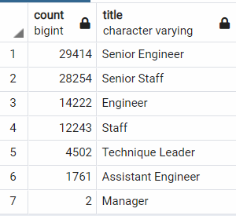

# Pewlett-Hackard-Analysis
## Overview of the Analysis
After our intial analysis and data upgrades we were tasked with 2 more projects to help prepare Pewlett-Hackard for an upcoming 'Silver Tsunami' as many employees reach retirement age. The assignments are;
    * Determine the number of retiring employees per title
    * Identify employees who are eligible to participate in the mentorship program.

## Results

### Retiring Employees per Title
  - Analysis shows that not only does PH have an incredible amount employees retiring a 
    high percentage of them are SENIOR STAFF and SENOIR ENGINEERS                                                                                   
  - Although there are JUNIOR STAFF and ENGINEERS to fill the roles there may be gaps intially      
                               
                         
  
  
### Employees Eligible for the Mentorship Program
  - There are 1549 employees that are eligible to mentor (insert fig) 
  - Of the titles eligible Senior Engineers and Engineers make up a majority of the pool. 
  - https://github.com/timmyclean/Pewlett-Hackard-Analysis/blob/main/Data/eligible.PNG                 
  -
## Summary

### Retiring Employees per Title
  - We would recommend that HP coordinate the 'Silver Tsunami' by reaching out to 
  Senior Staff to determine who would be interested in a "retirement package", 
  offer incentives to individuals who have been identified as strong leaders, and great teachers/mentors. 
  - Prior to promoting Junior Staff and Engineers ensure they have detialed
  plan of action when new hires come into the organization. 
  - Before any any retirement packages are completlty executed hold workshops or
  town hall style meetings to see if any new ideas or thoughts can be generated/passed down.
### Mentorship Program
  - Make it incentive based, "the more employees you get promoted or hired the more gain to the individual and company" 
  - Plan to have cross training more regularly to see if employees can fill needs internally, again offer incentives to training. 
### Additional Queries
  - We looked at adding more WHERE, AND statements to the mentorship_eligibility table, we wanted to see how many employees were "SENIOR" and who were in other roles, we found of the 1500 available around 500 were ENGINEERS. This showed us that less and less employees are becoming SENIOR staff and more focus is going into development. 
  - 
  
## Conclusion
Overall with the updates made to the Database system and integrating new tools will be very beneficial to PH. These in the long run will help streamline work, and better distrubute resources to areas that can help the bottom line with greater positive effect.
